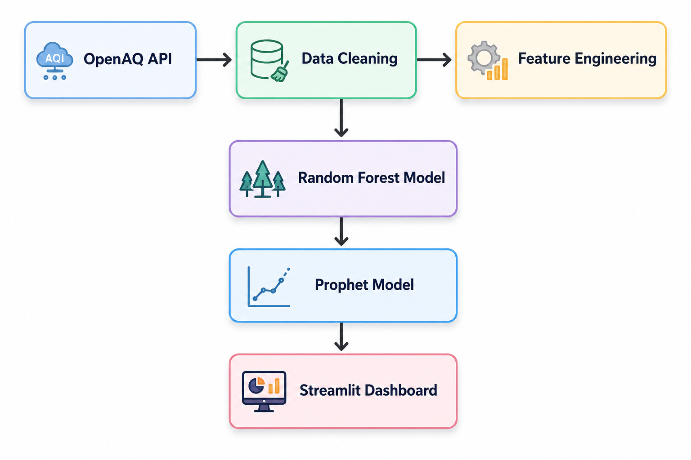

\# NYC Smart City Predictive Analytics


An end-to-end machine learning project that predicts PM2.5 pollution levels and forecasts energy demand for New York City using live public datasets from OpenAQ, NYC DOT, and the U.S. Energy Information Administration (EIA).

🔴 **Live Demo:** [Open Dashboard](https://smart-city-analytics-jexzhpr9k7vb97morgl7app.streamlit.app)

An end-to-end machine learning project that predicts PM2.5 pollution levels and forecasts energy demand for New York City using live public datasets from OpenAQ, NYC DOT, and the U.S. Energy Information Administration (EIA).


\## What it does

\- Predicts PM2.5 pollution levels based on hour of day, day of week, and energy demand

\- Forecasts NYC energy demand 48 hours ahead using time-series modeling

\- Includes a "what-if" simulator to explore how reducing city activity level could affect pollution

\- Continuously collects live NYC traffic data in the background for future model upgrades


\## Data sources

\- \*\*Air quality:\*\* \[OpenAQ API](https://openaq.org) — live pollutant readings (PM2.5, O3, NO2, and others) from NYC monitoring stations

\- \*\*Traffic:\*\* \[NYC DOT Real-Time Traffic Speeds](https://data.cityofnewyork.us) — live road segment speed data, collected hourly via an automated scheduler

\- \*\*Energy:\*\* \[EIA API](https://www.eia.gov/opendata/) — hourly electricity demand for New York State


\## Tech stack

\- \*\*Data processing:\*\* pandas

\- \*\*Modeling:\*\* scikit-learn (Random Forest), Prophet (time-series forecasting)

\- \*\*Dashboard:\*\* Streamlit, Plotly

## Project Workflow



\## Project pipeline

1\. \*\*Data collection\*\* — pulled real data from three public APIs

2\. \*\*Data engineering\*\* — cleaned missing values, aligned inconsistent time ranges across sources by hour-of-day/day-of-week patterns, merged into a unified dataset

3\. \*\*Modeling\*\* — trained and compared Linear Regression vs Random Forest for pollution prediction (Random Forest selected, MAE ≈ 2.5); trained Prophet for energy demand forecasting

4\. \*\*Dashboard\*\* — built an interactive 3-tab Streamlit app for exploring patterns, forecasts, and predictions

5\. \*\*What-if scenarios\*\* — added a live simulator showing predicted pollution impact of reduced city activity

## Model Performance

| Model | Purpose | Metric | Score |
|-------|----------|--------|------:|
| Random Forest | PM2.5 Prediction | MAE | 2.5 |
| Linear Regression | Baseline Comparison | MAE | Higher than Random Forest |
| Prophet | Energy Forecast | Forecast Horizon | 48 Hours |


## Project Structure

```text
smart-city-analytics/
│
├── app.py
├── data/
├── images/
├── fetch_air_quality.py
├── fetch_energy.py
├── fetch_traffic.py
├── clean_and_merge.py
├── train_model.py
├── forecast_energy.py
├── requirements.txt
└── README.md
```

\## Key finding

Day-of-week is the strongest predictor of pollution levels (42% feature importance) — even more than energy demand (37%) or hour of day (21%), suggesting weekly activity rhythms matter more than time-of-day alone.


\## Known limitations

\- Traffic data is still being collected (hourly, via an automated background job) and isn't yet part of the trained model — the current what-if simulator uses energy demand as a proxy for city activity level

\- Air quality readings span 2016–2023 depending on station uptime; patterns are averaged by hour/day rather than exact date due to inconsistent sensor availability across sources


\## Live demo

\[Live Demo](https://smart-city-analytics-jexzhpr9k7vb97morgl7app.streamlit.app)
## Air Quality Analytics


---

## Energy Demand Forecast


---

## Pollution Prediction & What-if Simulator


\## Run it locally

```bash

pip install -r requirements.txt

streamlit run app.py

```

