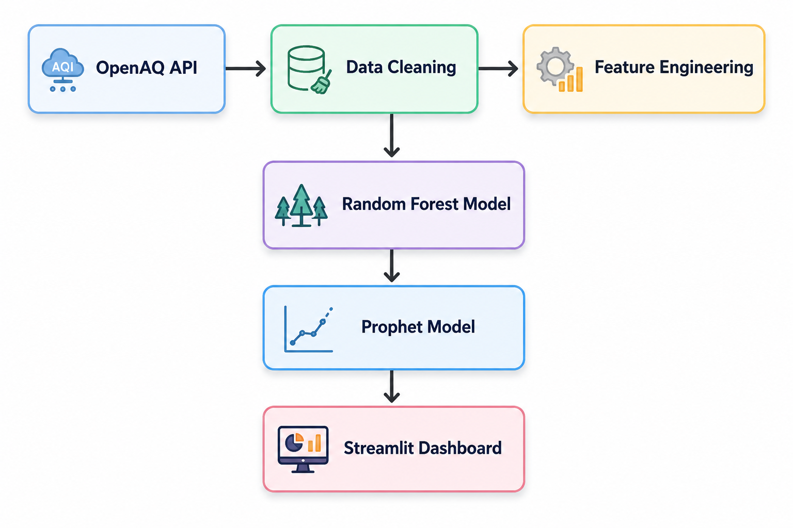

# 🏙️ NYC Smart City Predictive Analytics

### Machine Learning for Air Quality & Energy Demand Forecasting

  
  
  
  
  
  

An end-to-end machine learning project for analyzing NYC air quality,
predicting PM2.5 pollution, and forecasting energy demand using real-world public data.

---

## 📌 Project at a Glance

| 3 Public Data Sources | 2 Predictive Tasks | 48h Energy Forecast | ≈ 2.5 PM2.5 MAE | 3 Dashboard Tabs |
|:---:|:---:|:---:|:---:|:---:|
| 🌫️ 🚦 ⚡ | 🤖 | ⚡ | 📉 | 🖥️ |

---

## 🔎 What is NYC Smart City Predictive Analytics?

NYC Smart City Predictive Analytics is an end-to-end machine learning project that combines public datasets from **OpenAQ, NYC DOT, and the U.S. Energy Information Administration (EIA)** to study air quality and energy-demand patterns in New York City.

The project demonstrates a complete data science workflow:

    Public APIs
          ↓
    Data Collection
          ↓
    Data Cleaning
          ↓
    Feature Engineering
          ↓
    Machine Learning
          ↓
    Model Evaluation
          ↓
    Forecasting
          ↓
    Interactive Dashboard

The platform currently focuses on two predictive tasks:

- 🌫️ **PM2.5 pollution prediction**
- ⚡ **48-hour energy demand forecasting**

It also includes an interactive what-if simulator for exploring potential pollution changes under reduced city-activity scenarios.

---

## 💡 Why This Project?

Modern cities generate huge amounts of environmental, transportation, and energy data.

The challenge is turning this data into useful analytical insights.

This project explores questions such as:

- How does pollution vary across different times and days?
- Which features contribute most to PM2.5 predictions?
- Can electricity demand be forecast 48 hours into the future?
- How could changes in city activity affect predicted pollution?
- How can continuously collected traffic data be incorporated into future models?

The goal is to demonstrate a practical smart-city analytics pipeline rather than a standalone machine-learning model.

---

## 🚀 Core Capabilities

### 🌫️ PM2.5 Prediction

Predicts PM2.5 pollution levels using:

- Hour of day
- Day of week
- Energy demand

**Models evaluated:**

- Linear Regression
- Random Forest

---

### ⚡ Energy Demand Forecasting

Uses **Prophet time-series forecasting** to predict electricity demand.

**Forecast Horizon:** 48 hours

    Historical Energy Demand
              ↓
         Time-Series Data
              ↓
            Prophet
              ↓
        48-Hour Forecast

---

### 🔮 What-If Pollution Simulator

Allows users to experiment with reduced city-activity scenarios and observe the corresponding predicted PM2.5 level.

The current simulator uses **energy demand as a proxy for city activity**.

---

### 🚦 Live Traffic Data Collection

NYC traffic-speed data is collected hourly through an automated background process.

The traffic dataset is currently being accumulated for future model improvements and is **not yet included in the trained PM2.5 prediction model**.

---

## 🧠 Machine Learning Pipeline

    ┌──────────────────────────────────────┐
    │           PUBLIC DATA SOURCES        │
    │                                      │
    │   OpenAQ  │  NYC DOT  │  EIA         │
    └──────────────────┬───────────────────┘
                       │
                       ▼
    ┌──────────────────────────────────────┐
    │          DATA COLLECTION              │
    │                                      │
    │ Air Quality │ Traffic │ Energy       │
    └──────────────────┬───────────────────┘
                       │
                       ▼
    ┌──────────────────────────────────────┐
    │          DATA ENGINEERING             │
    │                                      │
    │ Cleaning │ Missing Values │ Time      │
    │ Alignment │ Aggregation │ Merging     │
    └──────────────────┬───────────────────┘
                       │
                       ▼
    ┌──────────────────────────────────────┐
    │         FEATURE ENGINEERING          │
    │                                      │
    │ Hour of Day │ Day of Week            │
    │ Energy Demand                         │
    └──────────────────┬───────────────────┘
                       │
              ┌────────┴────────┐
              ▼                 ▼
    ┌──────────────────┐ ┌──────────────────┐
    │ PM2.5 Prediction │ │ Energy Forecast  │
    │                  │ │                  │
    │ Linear Regression│ │     Prophet      │
    │        ↓         │ │        ↓         │
    │ Random Forest    │ │   48-Hour        │
    │                  │ │   Forecast       │
    └────────┬─────────┘ └────────┬─────────┘
             │                    │
             └─────────┬──────────┘
                       ▼
    ┌──────────────────────────────────────┐
    │        STREAMLIT DASHBOARD           │
    │                                      │
    │ Analytics │ Forecast │ Prediction    │
    │           │          │ What-If       │
    └──────────────────────────────────────┘

---

# 🔄 Project Workflow

## 1. Data Collection

The project collects real-world data from multiple public APIs.

### 🌫️ OpenAQ

Provides air-quality measurements including:

- PM2.5
- O₃
- NO₂
- Other available pollutants

### 🚦 NYC DOT

Provides real-time road-segment traffic-speed data.

### ⚡ EIA

Provides hourly electricity-demand data for New York State.

---

## 2. Data Engineering

The raw API responses are processed to make them suitable for analysis and machine learning.

Processing includes:

- Cleaning raw API responses
- Handling missing values
- Processing timestamps
- Extracting hour-of-day
- Extracting day-of-week
- Aligning inconsistent time ranges
- Aggregating observations
- Merging datasets

Because the datasets have different periods of availability, relationships are aligned using **hour-of-day and day-of-week patterns rather than exact date matching**.

---

## 3. Feature Engineering

The current PM2.5 prediction model uses:

    Hour of Day
          +
    Day of Week
          +
    Energy Demand
          ↓
    PM2.5 Prediction

---

## 4. Model Training

Two models were evaluated for PM2.5 prediction.

### Linear Regression

Used as the baseline model.

### Random Forest

Used as the primary machine-learning model.

The models were compared using **Mean Absolute Error (MAE)**.

Random Forest achieved an approximate **MAE of 2.5**.

---

## 5. Energy Forecasting

Historical electricity-demand data is modeled using Prophet.

    Historical Energy Demand
              ↓
        Time-Series Data
              ↓
            Prophet
              ↓
        48-Hour Forecast

---

## 6. Dashboard Integration

The trained models are integrated into an interactive Streamlit dashboard.

The application provides:

- Historical air-quality analysis
- Energy demand forecasting
- PM2.5 prediction
- What-if scenario analysis

---

# 📈 Model Performance

## PM2.5 Prediction

| Model | Purpose | Metric | Result |
|---|---|---|---|
| **Random Forest** | PM2.5 Prediction | MAE | **≈ 2.5** |
| Linear Regression | Baseline Comparison | MAE | Higher than Random Forest |

## Energy Forecasting

| Model | Purpose | Forecast Horizon |
|---|---|---|
| **Prophet** | Energy Demand Forecasting | **48 Hours** |

---

# 🔍 Key Finding

### Feature Importance

| Feature | Importance |
|---|---:|
| **Day of Week** | **42%** |
| **Energy Demand** | **37%** |
| **Hour of Day** | **21%** |

Within the trained model and dataset, **Day of Week** had the highest feature importance, followed by **Energy Demand** and **Hour of Day**.

> **Important:** Feature importance describes the behavior of the trained model. It does not establish that a feature directly causes changes in pollution.

---

# 🗃️ Data Sources

## 🌫️ OpenAQ

**Purpose:** Air-quality measurements

**Data:**

- PM2.5
- O₃
- NO₂
- Other available pollutants

**Source:** https://openaq.org

---

## 🚦 NYC Open Data / NYC DOT

**Purpose:** Real-time traffic speeds

Provides road-segment speed measurements collected hourly for future integration into the prediction system.

**Source:** https://data.cityofnewyork.us

---

## ⚡ U.S. Energy Information Administration

**Purpose:** Electricity demand

Provides hourly electricity-demand data for New York State.

**Source:** https://www.eia.gov/opendata/

---

# 🖥️ Interactive Dashboard

The project contains a **3-tab Streamlit application**.

### 1. 🌫️ Air Quality Analytics

Explore historical air-quality patterns and understand how pollution varies across different temporal patterns.

---

### 2. ⚡ Energy Demand Forecast

View predicted energy demand for the next 48 hours.

---

### 3. 🔮 Pollution Prediction & What-If Simulator

Generate PM2.5 predictions and experiment with reduced city-activity scenarios.

---

## 🔄 Project Workflow

---

# 🛠️ Technology Stack

| Category | Technology | Purpose |
|---|---|---|
| **Programming** | Python 3.11 | Core development |
| **Data Processing** | pandas | Cleaning and transformation |
| **Machine Learning** | scikit-learn | Model training and evaluation |
| **Prediction Model** | Random Forest | PM2.5 prediction |
| **Baseline Model** | Linear Regression | Model comparison |
| **Time-Series** | Prophet | Energy-demand forecasting |
| **Dashboard** | Streamlit | Interactive web application |
| **Visualization** | Plotly | Interactive charts |
| **Air Quality** | OpenAQ API | Pollution measurements |
| **Traffic** | NYC DOT | Traffic-speed data |
| **Energy** | EIA API | Electricity-demand data |

---

# 📁 Project Structure

    smart-city-analytics/
    │
    ├── app.py
    │
    ├── data/
    │   └── processed datasets
    │
    ├── images/
    │   ├── workflow.png
    │   ├── Air Quality Pattern.png
    │   ├── Energy Forecast.png
    │   └── Pollution Predictor.png
    │
    ├── fetch_air_quality.py
    ├── fetch_energy.py
    ├── fetch_traffic.py
    ├── clean_and_merge.py
    ├── train_model.py
    ├── forecast_energy.py
    │
    ├── requirements.txt
    ├── README.md
    └── LICENSE

---

# 📚 Project Files

| File | Description |
|---|---|
| `app.py` | Streamlit dashboard |
| `fetch_air_quality.py` | Collects OpenAQ air-quality data |
| `fetch_energy.py` | Collects EIA energy-demand data |
| `fetch_traffic.py` | Collects NYC traffic-speed data |
| `clean_and_merge.py` | Cleans and combines datasets |
| `train_model.py` | Trains and evaluates PM2.5 models |
| `forecast_energy.py` | Generates energy-demand forecasts |
| `requirements.txt` | Python dependencies |
| `images/` | README and dashboard visuals |

---

# 🚀 Getting Started

## Prerequisites

Before running the project locally, install:

- Python 3.11 or compatible version
- Git
- Internet connection for public API access

Check your Python version:

    python --version

---

## 1. Clone the Repository

    git clone https://github.com/VIMAL-999/smart-city-analytics.git

---

## 2. Navigate to the Project

    cd smart-city-analytics

---

## 3. Install Dependencies

    pip install -r requirements.txt

---

## 4. Run the Application

Start the Streamlit dashboard:

    streamlit run app.py

The application will open in your browser.

---

# 🌐 Live Demo

---

# ⚠️ Known Limitations

### 🚦 Traffic Data Not Yet Integrated

Live NYC traffic data is currently collected hourly but is not yet included as a feature in the trained PM2.5 prediction model.

The data is being collected for future model improvements.

### 🌫️ Air Quality Data Availability

Air-quality observations cover different periods depending on monitoring-station availability.

The available historical observations span approximately **2016–2023**, with station uptime varying across locations and periods.

### 🕐 Time Alignment

The datasets have different:

- Date ranges
- Sampling periods
- Availability
- Sensor coverage

Therefore, some relationships are aligned using hour-of-day and day-of-week patterns rather than exact date-level matching.

### 🔮 What-If Simulator

The current simulator uses **energy demand as a proxy for city activity**.

Direct traffic-based activity modeling has not yet been integrated into the trained prediction model.

### 📊 Limited Prediction Features

The current PM2.5 prediction model uses:

- Hour of day
- Day of week
- Energy demand

Additional environmental and meteorological variables could improve future versions.

---

# 🔮 Future Development

## 01. 🚦 Live Traffic Integration

Integrate collected traffic-speed data directly into the PM2.5 prediction pipeline.

Potential features include:

- Average traffic speed
- Traffic intensity
- Road-segment activity
- Temporal traffic patterns

---

## 02. 🌦️ Weather Integration

Add weather variables that may provide additional predictive information:

- Temperature
- Humidity
- Wind speed
- Atmospheric pressure
- Precipitation

---

## 03. 🔄 Automated Model Retraining

Develop an automated pipeline:

    Collect New Data
           ↓
    Validate Data
           ↓
    Clean & Transform
           ↓
    Feature Engineering
           ↓
    Retrain Model
           ↓
    Evaluate Model
           ↓
    Deploy Updated Model

---

## 04. 🐳 Docker Deployment

Containerize the application using Docker to improve:

- Reproducibility
- Deployment
- Environment management
- Portability

---

## 05. 🌫️ Multi-Pollutant Prediction

Extend the prediction system beyond PM2.5 to include:

- NO₂
- O₃
- CO
- PM10

---

## 06. 📍 Location-Based Predictions

Future versions could provide more granular predictions at:

- Monitoring-station level
- Neighborhood level
- Borough level

instead of relying primarily on city-wide patterns.

---

## 07. 🤖 Automated ML Pipeline

A future production architecture could include:

    Data Sources
          ↓
    Data Ingestion
          ↓
    Data Validation
          ↓
    Feature Engineering
          ↓
    Model Training
          ↓
    Model Evaluation
          ↓
    Model Registry
          ↓
    Deployment
          ↓
    Monitoring
          ↓
    Automated Retraining

---

# 📌 Key Takeaways

| Metric / Component | Result |
|---|---|
| 🤖 PM2.5 Model | Random Forest |
| 📉 PM2.5 MAE | ≈ 2.5 |
| ⚡ Energy Forecast | 48 Hours |
| 🗓️ Strongest Feature | Day of Week |
| 📊 Day-of-Week Importance | 42% |
| ⚡ Energy Demand Importance | 37% |
| 🕐 Hour-of-Day Importance | 21% |
| 🌫️ Air Quality Source | OpenAQ |
| 🚦 Traffic Source | NYC DOT |
| ⚡ Energy Source | EIA |
| 🖥️ Dashboard | Streamlit |
| 📊 Visualization | Plotly |

---

# 📚 Documentation

| Component | Description |
|---|---|
| **Data Collection** | API-based collection from OpenAQ, NYC DOT, and EIA |
| **Data Engineering** | Cleaning, transformation, alignment, and merging |
| **Machine Learning** | Random Forest and Linear Regression |
| **Forecasting** | Prophet-based 48-hour energy forecast |
| **What-If Analysis** | Interactive pollution scenario simulation |
| **Dashboard** | Streamlit-based visualization and analytics |
| **Traffic Pipeline** | Automated collection for future model development |

---

# 🤝 Contributing

Contributions are welcome.

### Contribution Steps

1. Fork the repository
2. Create a feature branch
3. Make your changes
4. Test locally
5. Commit your changes
6. Open a Pull Request

---

# 📄 License

This project is licensed under the **MIT License**.

See the `LICENSE` file for details.

---

## 🏙️ NYC Smart City Predictive Analytics

**Machine Learning • Public Data • Smart City Analytics • Forecasting**

Built with Python, scikit-learn, Prophet, Streamlit & Plotly.

